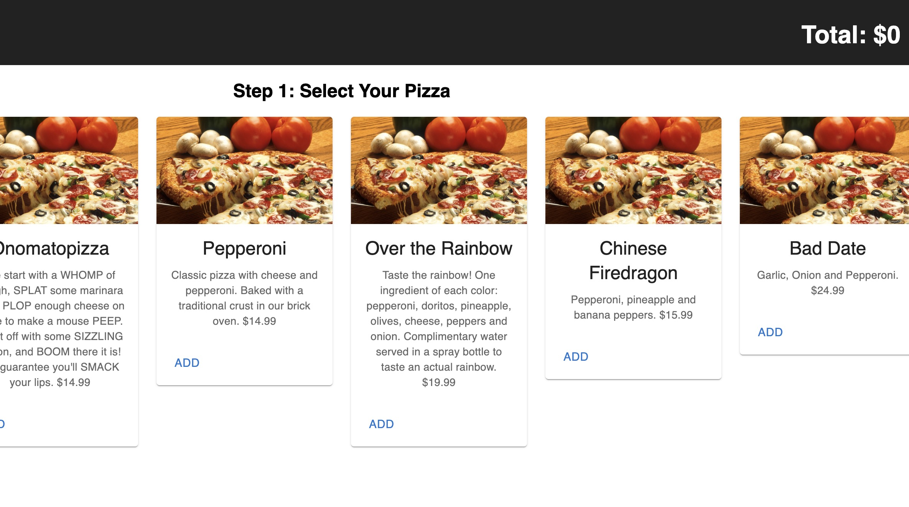
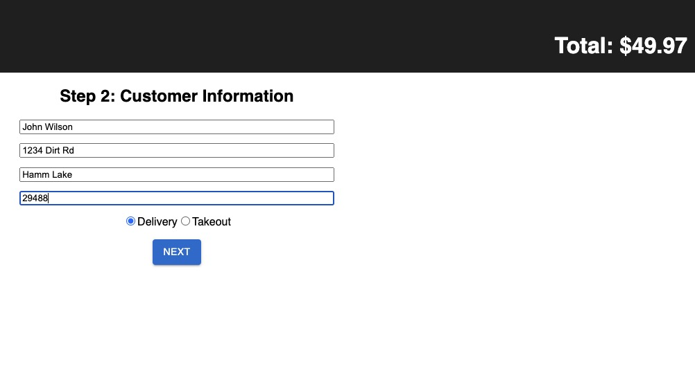
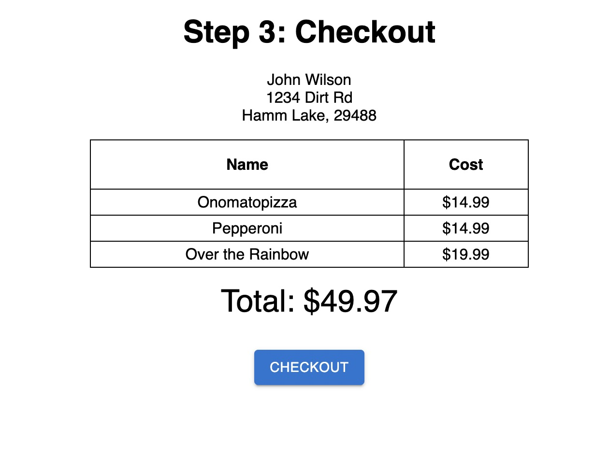

# Pizza Parlor

## Description

_Duration: 1 day group project_

This project is a single page application (SPA) for a pizza website.
(Step 1) The main page shows a list of all pizzas the user can add to their cart and see the total price updated.
(Step 2) After clicking "NEXT" the user is brought to a page to enter user contact information and choose delivery option.
(Step 3) Finally, the user can review their order on the checkout page and submit the order by clicking "CHECKOUT" and the order will be saved to the database.

## Screenshots
Step 1:

Step 2:

Step 3:

### Prerequisites

- [Node.js](https://nodejs.org/en/)

## Installation

1. Create a database named `pizza_parlor`
2. The queries in the `database.sql` file are set up to create all the necessary tables and populate the needed data to allow the application to run correctly. The project is built on [Postgres](https://www.postgresql.org/download/), so you will need to make sure to have that installed. Recommend using Postico to run the queries as that was used to create the queries. 
3. Open up your editor of choice and run `npm install`
4. Run `npm run server` in a terminal
5. Run `npm run client` in another terminal
6. The `npm run client` command will open up a new browser tab for you
